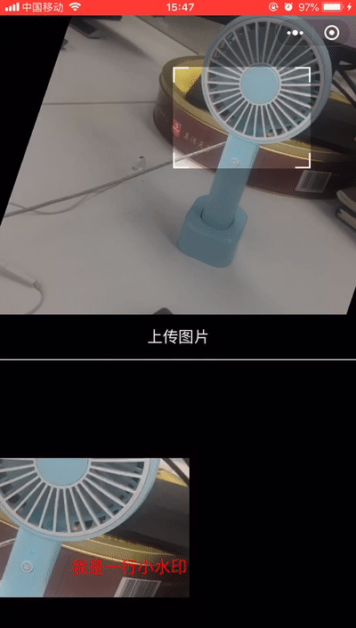

# uniapp-nice-cropper

## 一款转门为uniapp定制的图片裁剪组件

##### 1. 支持多种手势操作
##### 2. 纯CSS实现操作预览，性能高，流畅不卡顿
##### 3. 兼容多个小程序平台
##### 4. 使用简单，高度可配置，并提供丰富的API

**各平台支持情况：**

|平台|微信小程序|支付宝小程序|百度小程序| 头条小程序|QQ小程序|钉钉小程序|快应用|原生APP|
|----|:-------:|:---------:|:-------:|:--------:|:-----:|:-------:|:----:|:-----:|
|支持|√ |√ |√ |√ |√ |√  |√ |未知 |

> 由于条件限制，在原生app的表现暂未测试，欢迎测试并提issues


**效果预览：**




> 若无法预览图片，将添加DNS解析：`151.101.0.133 raw.githubusercontent.com`


### 安装

#### 1. 下载组件目录，并放置至项目的组件目录

#### 2. uniapp插件市场导入


### 使用方法

#### 1.引入组件

下载仓库中的代码，将src目录下的`cropper.js`和`cropper.vue`文件拷贝至项目的组件目录(如`components/nice-cropper`),然后在页面引入组件

```javascript
import ImageCropper from '@/components/nice-cropper/cropper.vue'

```

#### 2. 在Vue实例中声明组件

```javascript
export default {
  components: {
    ImageCropper
  },
  methods: {
     beforeDraw(context, transform) {
      context.setFillStyle('yellow')
      transform.zoom = 2
    },
    afterDraw(ctx, info) {
      ctx.fillText('我是一行文字水印', 20, 20)
      console.log(`当前画布大小：${info.width}*${info.height}`)
    },
    cropped(imagePath, imageInfo) {
      console.log(imagePath, imageInfo)
    }
  }
}
```

#### 3. 在template模板中使用组件

```html
<template>
  <view class="container">
    <view class="cropper-wrap">
      <image-cropper
        id="image-cropper"
        :zoom="1"
        :angle="0"
        :src="src"
        canvasBackground="red"
        @cropped="cropped"
        @afterDraw="afterDraw"
        @beforeDraw="beforeDraw"
      />
    </view>
  </view>
</template>
```

### 组件属性

|属性|类型|是否必须|默认值|描述|
|----|:----|:---:|:----:|---:|
|width|[Number, String]|是|100%|容器的宽度，支持rpx，px和百分比|
|height|[Number, String]|是|100%|容器高度，规则同width|
|cutWidth|[Number, String]|是|50%|裁剪宽宽度，默认为容器的一半|
|cutHeight|[Number, String]|否|空|裁剪宽高度，不传默认等于cutWidth|
|minWidth|Number|否|50|裁剪框的最小宽度，单位px|
|minHeight|Number|否|50|裁剪框的最小高度，单位px|
|center|Boolean|否|true|初始化时裁剪框是否在容器中居中|
|src|String|是|空|原始图片的路径，不支持网络图片|
|disableScale|Boolean|否|false|是否禁止缩放|
|disableRotate|Boolean|否|false|是否禁止旋转|
|disableTranslate|Boolean|否|false|是否禁止平移|
|disableCtrl|Boolean|否|false|是否禁止裁剪框调整|
|boundDetect|Boolean|否|false|是否开启边界探测，开启后，图片会被限制在裁剪框内|
|freeBoundDetect|Boolean|否|false|旋转时开启边界探测，默认旋转不会进行边界探测|
|keepRatio|Boolean|否|false|是否固定裁剪框比例|
|disablePreview|Boolean|否|false|是否禁止预览，默认开启预览，每次操作结束会高亮突出裁剪区域|
|maxZoom|Number|否|10|图片最大的放大倍数|
|minZoom|Number|否|1|图片最小的缩放倍数|
|angle|Number|否|0|初始化时的旋转角度，单位度|
|zoom|Number|否|1|初始化的放大缩放倍数|
|offset|Array<Number, Number>|否|`[0, 0]`|初始化时图片左侧相对裁剪框左侧的偏移量|
|background|String|否|#000|容器的背景|
|canvasBackground|String|否|#fff|导出图片时，图片的背景|
|canvasZoom|Number|否|1|导出图片的大小相对于裁剪框大小的倍数|
|fileType|String|否|png|导出图片的格式，仅支持png和jpg|
|quality|Number|否|1|导出图片的质量，值为(0,1]，非法值均按照1处理|

### 事件

组件提供了一组事件，用于在各个操作阶段做自定义的操作处理

|事件名称|回调参数|说明|
|-------|-------|----|
|load|(img)|图片加载完成回调，img为图片信息|
|error|(err)|图片加载失败的回调，err为错误信息|
|beforeDraw|(context, transform)|画布绘制前的钩子，可以在绘制前对画布做一些操作，如改变背景色，设置透明度等，其中context为当前画布上下文，tranform为画布变换的具体参数|
|afterDraw|(context, canvasInfo)|canvas绘制后的钩子，可以对画布做额外的操作，如添加水印，滤镜等。context为上下文，canvasInfo为包含画布宽高的对象|
|cropped|(imagePath, imageInfo)|裁剪结果回调，imagePath为裁剪后的图片路径，imageInfo为图片信息，包括操作结果的信息以及原图片的大小信息|
|doubleTap|无|预留事件，双击画布时触发，当前没做任何处理，如有需要可自定义相应处理事件|

### API（实例方法）

除了事件与基本的组件属性，还可以通过以下实例方法对组件进行相应的操作。获取实例可以通过`this.$refs`获取

|实例方法|参数|说明|
|-------|----|----|
|setTransform|(x:Number, y:Number, angle:Number, scale:Number）|设置变换信息，分别对应translateX,translateY, rotate(单位为度）,scale缩放倍数|
|setTranslate|([x:Number, y:Number])|设置平移的量|
|setZoom| scale:Number| 设置缩放倍数|
|setRotate| angle: Number| 设置旋转的角度，单位为度|


## 其它

如果你觉得这个组件对你有帮助，感谢加个star。

如果有什么好的建议，欢迎提issues或者提pr


